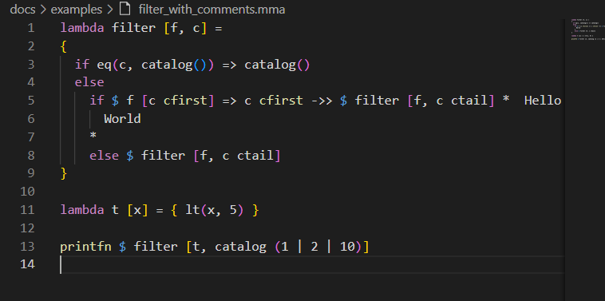

# Starlight Sky

### [GitHub Pages](https://zbelka100.github.io/funclogprog/)

## Разделы: 
- [Starlight Sky](#starlight-sky)
  - [О языке](#о-языке)
  - [Использование интерпретатора](#использование-интерпретатора)
  - [Установка расширения для подсветки синтаксиса](#установка-расширения-для-подсветки-синтаксиса)
  - [Синтаксис языка и примеры использования](#синтаксис-языка-и-примеры-использования)
    - [Операции](#операции)
    - [Переменные](#переменные)
    - [Комментарии](#комментарии)
    - [Функции](#функции)
      - [Функция вычисляющая факториал](#функция-вычисляющая-факториал)
    - [Списки](#списки)
    - [Ветвление](#ветвление)
    - [Вывод данных](#вывод-данных)
    - [Операции с файлом](#операции-с-файлом)
      - [Чтение](#чтение)
      - [Запись](#запись)
    - [Другие примеры](#другие-примеры)
  - [Стандартная библиотека](#стандартная-библиотека)
  - [Таблица участников и их обязанности](#таблица-участников-и-их-обязанности)
  - [Эссе](#эссе)

## О языке
Особенности нашего функционального языка: он ленивый, вычисления не будут делаться, пока не попросят; он не чувствителен к пробелам и табуляциям.

Реализованные функции:

* [x] Именованные переменные (`let`)
* [x] Рекурсия
* [x] Ленивое вычисление
* [x] Функции
* [x] Замыкания
* [x] Комментарии
* [x] Библиотечные функции: ввод-вывод файлов
* [x] Списки
* [x] Библиотечные функции: списки
* [x] Стандартная библиотека


## Использование интерпретатора
Для запуска собственных програм `.mma`, необходимо скачать последний релиз из [списка релизов](https://github.com/MAILabs-Edu-2024/fp-compiler-lab-starlight-sky/releases), и запустить интерпретатор командой через консоль (windows):
```

./*PATH TO INTERPRETER*/Main.exe *PATH TO .mma FILES*
```

Либо самостоятельно собрав проект из исходных файлов, и также запустить, подав на вход аргументами командной строки пути к интерпретируемомым файлам.

> :warning: **Важно**: При запуске небходимо подавать файлы программ `.mma` в том порядке, в котором находятся зависимости, например при использовании стандартной библиотеки, сначала подать на вход её, а затем файл, который будет её использовать

Допустимо использование флага `tracing=true` для вывода отладочной информации (должен идти первым аргументом)

```
./*PATH TO INTERPRETER*/Main.exe tracing=true *PATH TO .mma FILES*
```

Также в комплекте поставляется стандартная библиотека, которую можно компилировать вместе со своими файлами `standart_library.mma`. Её более подробное описание есть [ниже](#стандартная-библиотека).

## Установка расширения для подсветки синтаксиса

[Расширение](mmaextention/mmaextention-1.1.0.vsix) - файл `mmaextention-1.1.0.vsix`. 

Для его установки во вкладке `Extentions` >> `Install from VSIX`>> файл расширения.



## Синтаксис языка и примеры использования

### Операции

В языке присутствуют операции:

- сложения (`add(float, float)`)
- вычитания (`sub(float, float)`)
- умножения (`mul(float, float)`)
- деления (`div(float, float)`)

А также, операции сравнения:

- равенства (`eq(_, _)` для строк и чисел типа `float`)
- неравенства (`neq(_, _)` для строк и чисел типа `float`)
- больше (`gt(float1, float2)` - `float1 > float2`)
- меньше (`lt(float1, float2)` - `float1 < float2`)
- больше или равно (`gte(float1, float2)` - `float1 >= float2`)
- меньше или равно (`lte(float1, float2)` - `float1 <= float2`).


### Переменные

Переменные в языке определяются словом `detect` как показано на примере ниже:

```
detect _fl_var = 13

printfn _fl_var
```

```
detect x = printfn "Hello world!"
x
```

### Комментарии

Комментарии в языке определяются двумя символами `*`, обозначающие начало и конец области:

```
detect _fl_var = 13 *
  COMMENT example
 printfn _fl_var <--- that will not printed

*

printfn _fl_var
```

### Функции 

Для написания функции необходимо воспользоваться ключевым словом `lambda`. Для создания функции необходимо сделать патерну: `lambda name_of_function [arguments, for, your, function] = {your code}`.

Для вызова функции необходимо воспользоваться знаком `$`. Соответственно вызов функции имеет патерн: `$ func_name [list, of, arguments]`. Пример:

#### Функция вычисляющая факториал

```
lambda factorial [_x] = { if eq(   _x, 1         ) => 1 else mul(_x, $ factorial [sub( _x, 1)]) }

printfn $ factorial [7]
printfn $ factorial [8]

```


### Списки

В нашем языке представлены списки называемые `catalog` (каталоги). Элементы внутри каталога разделяются при помощи `|`. В каталоге могут находится любые сущности. 

Пример каталога: 


Для каталогов реализованы базовые операции, позволяющие делать все что угодно: 

- `catalog_name сfirst` - возвращает первый элемент списка

```
printfn catalog (1 | 2 | x | catalog (5 | 10) | "Hi!") cfirst

```


- `catalog_name сtail` - возвращает хвост списка
  
```
detect list = catalog (1 | 2 | x | catalog (5 | 10) | "Hi!") 


printfn list ctail

```


- `catalog_name_1' <-> 'catalog_name_2` - конкатенация каталогов.
```
detect list = catalog (1 | 2 | x | catalog (5 | 10) | "Hi!") <-> catalog (a | b | c) 

printfn list
```
Или так
```
printfn catalog (1 | 2 | x | catalog (5 | 10) | "Hi!") <-> catalog (a | b | c)
```

- `element' ->> 'catalog_name` - добавление элемента в список.
```
printfn 4 ->> catalog(-5 | 10 | 2)
```


### Ветвление 

Для создания условий в язык введены `if`, `else`, `=>`. Для строительства условного оператора необходимо придерживаться синтаксиса: `if` `conditions` `=>` `code_if_conditions_true` `else` `code_if_conditions_false`.

```
lambda check [x] = { if eq(x, 1 ) => printfn 1 else printfn 2 }
$ check [10]
```

### Вывод данных

Для вывода данных существует две функции `print` и `printfn`. Функции могут выводить `string`, `float`, `catalog`, `bool` в случае попытки вывести что-то иное, существует обработка ошибок.

### Операции с файлом

Для операций с файлами существуют команды `ReadFromFile` и `WriteToFile`. В аргументах функции принимают: `ReadFromFile path/to/file` и `WriteToFile path/to/file string`. Пример синтаксиса работы с файлами: 

#### Чтение
```
detect x = ReadFromFile "tests.mma"

printfn x

```
#### Запись
```
WriteToFile "tests.mma" "Hello World!"

detect x = ReadFromFile "tests.mma"
printfn x

```

### Другие примеры
Вы можете найти другие примеры написанные на языке `S_S` [в папке примеров](docs/examples/), а также их можно запустить с помощью интерпретатора.

## Стандартная библиотека

Для упрощения работы с языком, написана стандартная [библиотека](Main/standart_library.mma).

`catalog_search_by [catalog, function, start_value]` - поиск в списке последнего элемента, удволетворяющего фунции

Пример использования :
```
detect x = catalog (1 | 2 | 3 | 55)
lambda test [a, b] = {
  if lt(a, b) => true
  else false
}
printfn $ test[0, x cfirst]

printfn $ catalog_search_by [x, test, 0]
```

`factorial [n]` - нахождение факториала числа

Пример использования :
```
printfn $ factorial [5]

```

`pow [2, 10]` - возведение числа в степень

Пример использования :
```
printfn $ pow [2, 10]
```


`filter [function, catalog]` - составление нового списка, где элемнты удволетворяют условию `function`

Пример использования :
```
lambda less_5 [x] = { lt(x, 5) }

printfn $ filter [less_5, catalog (1 | 2 | 10)]
```

`sum_catalog [catalog]` - нахождение суммы каталога

Пример использования :
```
printfn $ sum_catalog [catalog(0 | 2 | 4 | 6)]
```

`catalog_fold [catalog, funtion, acc]` - свёртка каталога

Пример использования :
```
lambda mult [a, b] = 
{
    mul(a, b)
}

printfn $ catalog_fold [catalog(1 | 2 | 4 | 6), mult, 1]
```

`map [funcion, catalog]` - получение нового каталога, где к каждому элементу исходного применена функция

Пример использования :
```
lambda square [x] = { mul(x, x) }

printfn $ map [square, catalog (1 | 2 | 10)]
```

`at_index [catalog, ind]` - поиск элемента по индексу

Пример использования :
```
printfn $ at_index [catalog (1 | 52 | 10), 1]

```
`get_length [catalog]` - поиск длины списка

Пример использования :
```
printfn $ get_length [catalog (1 | 52 | 10 | true | x)]
```


## Таблица участников и их обязанности

| Создатель       | Обязанности                  |
|-----------------|------------------------------|
| Михаил Губарев  |Создание интерпретатора и структуры AST|
| Максим Заславцев| Создание парсера и синтаксиса языка|
| Андрей Забелкин | Расширение для VS code, документация|


## Эссе

Эссе на тему "Приёмы функционального программирования, как мы их использовали при выполнении курсовой, и как будем использовать в дальнейшей жизни" расположено [тут](essay.pdf).